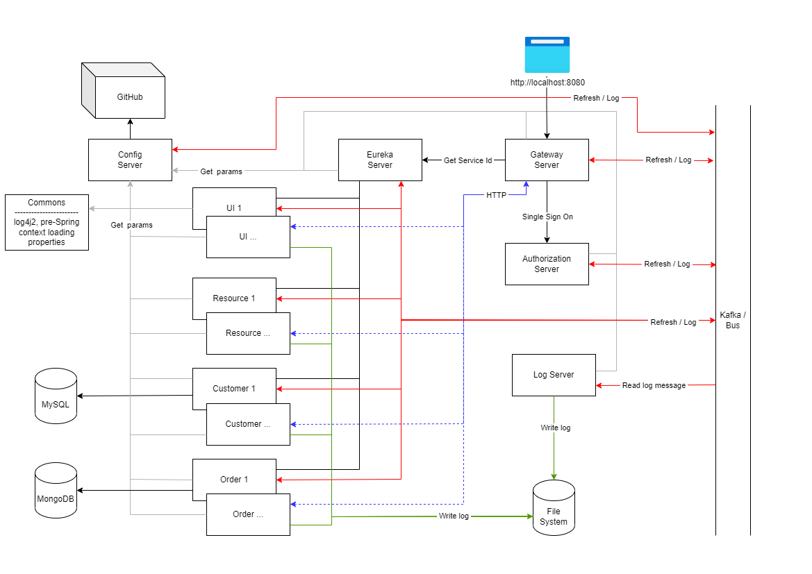

# Oauth2
## Goal
The main goal of oauth2 project is to study microservices, oauth2 concepts, Spring Framework
## Architecture

## Modules
| Module | Java | Spring Boot | OAuth2 | CSRF | Description |
|-|:-:|:-:|:-:|:-:|-|
|[commons](commons)|1.8|-|-|-|Common module for the whole project, contains default properties which are initialized before Spring context loading |
|[authorization-server](authorization-server)|1.8|1.5.22|+|+|Oauth2 authorization server|
|[config-server](config-server)|17|3.0.2|-|-|Config server, loads properties from [GitHub repository](https://github.com/arslucky/properties/blob/main/oauth2.properties)|
|[log-server](log-server)|17|3.0.2|-|-|Log server, reads log messages from the Kafka broker and outputs to a console and file|
|[eureka-server](eureka-server)|17|3.0.2|-|-|Eureka server to register services|
|[gateway-zuul](gateway-zuul)|1.8|1.5.22|+|+| Zuul Gateway, the main application entry point, OAuth2 Single Sign On (SSO), set 'trace-id' HTTP header to downstream requests for tracing between services|
|[ui](ui)|1.8|1.5.22|+|+|User interface|
|[resource](resource)|1.8|1.5.22|+|+|Resource service, takes requests and returns response, no storage layer |
|[customer-service](customer-service)|17|3.0.2|TODO|TODO|Customer service, stores Customer and Account data in MySQL DB|
|[order-service](order-service)|17|3.0.2|TODO|TODO|Order service, stores Order and Invoice data in MongoDB|

## Environment
Default application [properties](commons/src/main/resources/default.properties) and [dev properties](commons/src/main/resources/default-dev.properties) are put to the [commons](commons) module and available 
in the each module classpath as a library. This approach allows to store all **pre-Spring context** loading settings in one place and make easier running 
applications and testing in an IDE without extra variable settings.
Properties can be overridden in a command line.
 
## Build
### Linux
Run [build.sh](build.sh)
Set correct `JAVA_HOME_8, JAVA_HOME_17` paths into the script before running
```sh
./buidl.sh
```
### Windows
Run [build.bat](build.bat)
Set correct `JAVA_HOME_8, JAVA_HOME_17` paths into the script before running
```sh
build.bat
```
## Maven
Use Maven [toolchains plugin](https://maven.apache.org/guides/mini/guide-using-toolchains.html) to support multiple java versions at building and running modules.
Each module contains [maven.config](commons/.mvn/maven.config) which refers to the parent [toolchains.xml](toolchains.xml) configuration file with multiple java versions 

## Run project
Applications can be run by multiple ways
1. Docker
    - General
        - [docker-env.sh](docker-env.sh) - export container environment variables including application [properties](commons/src/main/resources/default.properties)
            ```sh
            ./docker-env.sh
            ```
        - add host mapping
            ```sh 
            127.0.0.1 kafka
            ```
            Linux - /etc/hosts<br>
            Windows - C:\Windows\System32\drivers\etc\hosts
    - CLI
        [docker-build.sh](docker-build.sh) - create images and run containers in detached mode through Docker CLI. Initialize Kafka topic, MySQL, MongoDB data at first running
        ```sh
        ./docker-build.sh
        ```
    - Compose
        [docker-compose.yml](docker-compose.yml) - Docker compose file, all services are in one place. Disadvantage: contains extra services to initialize Kafka, MySQL, MongoDB by custom scripts<br>         
        [docker-compose.sh](docker-compose.sh) - Run Docker containers in detached mode. Initialize Kafka topic, MySQL, MongoDB data at first running
        ```sh
        ./docker-compose.sh
        ```
    - Initialize data<br>
        Kafka topic, MySQL, MongoDB data initialization `is run at first Docker containers running.` Scripts are involved to the build process by default
        - Kafka
            ```sh
            ./kafka-topics.sh --create --topic log --bootstrap-server $KAFKA_HOST:$KAFKA_PORT
            ```
        - MySQL
        *[dev-database.sql](customer-service/db/dev-database.sql)*
        - MongoDB
        *[dev-database.js](order-service/db/dev-database.js)*        
1. Standalone<br>
    Note: Zookeeper, Kafka, MySQL, MongoDB have to be up.
    - Initialization
        - create [Kafka topic](https://kafka.apache.org/quickstart)
        ```sh
        kafka-topics.sh --create --topic log --bootstrap-server $KAFKA_HOST:$KAFKA_PORT
        ```
        - init MySQL
        ```sh
        mysql -u$MYSQL_ROOT -p$MYSQL_ROOT_PASSWORD --host=$MYSQL_HOST --port=$MYSQL_PORT < ./customer-service/db/dev-database.sql
        ```
        - init MongoDB
        ```sh
        mongosh $MONGO_HOST:$MONGO_PORT --username $MONGO_ROOT --password $MONGO_ROOT_PASSWORD -f ./order-service/db/dev-database.js
        ```
    - Linux, [start.sh](start.sh) - Up modules/applications
        ```sh
        ./start.sh
        ```
    - Windows, [start.bat](start.bat) - Up modules/applications
        ```sh
        start.bat
        ```
        Note: Set correct `JAVA_HOME_8, JAVA_HOME_17` paths into the script before running
1. IDE<br>
Run by default any module/application, no extra efforts. To achieve that all common application settings were put to 
default [properties](commons/src/main/resources/default.properties) and build as a library

## Stop project
- Docker UI, stop container by Docker UI
- Docker CLI, stop container by [Docker CLI](https://docs.docker.com/engine/reference/commandline/stop/), for instance<br>
    ```sh
    docker stop ui
    ```
- Docker Compose, stop container(s) by [Docker Compose CLI](https://docs.docker.com/engine/reference/commandline/compose_stop/)<br>
    ```sh
    docker compose stop
    ```
- Standalone
    Linux - [stop.sh](stop.sh), kill process in the reverse starting order, with default 7 signal<br>
    ```sh
    ./stop.sh
    ```
    Windows - [stop.bat](stop.bat) kill process in the reverse starting order
    ```sh
    stop.bat
    ```

## Ports
Non default ports are used in this project. This allowed to find narrow places in the configurable settings.  
| Module | Port | [Environment properties](commons/src/main/resources/default.properties)|
|-|:-:|-|
|[commons](commons)|-|-|
|[authorization-server](authorization-server)|9000|AUTH_PORT|
|[config-server](config-server)|8889|CONFIG_SERVER_PORT|
|[log-server](log-server)|-|-|
|[eureka-server](eureka-server)|8762|EUREKA_PORT|
|[gateway-zuul](gateway-zuul)|8080|GTW_PORT|
|[ui](ui)|Random|-|
|[resource](resource)|Random|-|
|[customer-service](customer-service)|Random|-|
|[order-service](order-service)|Random|-|

| Service | Port | [Environment properties](commons/src/main/resources/default.properties)|
|-|:-:|-|
|Zookeeper|2182|ZOO_PORT|
|Kafka|9091|KAFKA_PORT|
|MySQL|3307|MYSQL_PORT|
|MongoDB|27018|MONGO_PORT|

## UI
The http://localhost:8080 the main entry point. Forward to authentication page if user has not loggined.

User / password:
- *user / password* - User role
- *admin / password* - Admin role
 
|UI element|HTTP Request|Role|Description|
|-|-|-|-|
|Logout|POST|USER, ADMIN|Logout from application, invalidate HTTP session on [gateway-zuul](gateway-zuul)|
|Welcome <user name>|-|USER, ADMIN| Display loggined user name|
|UI ID|GET|USER, ADMIN|Display [ui](ui) service instance id registered in [eureka-server](eureka-server). By default run 2 instances. Each click returns one of them based on Ribbon load balancer schema|
|Resource ID|GET|USER, ADMIN|Display [resource](resource) service instance id registered in [eureka-server](eureka-server). By default run 2 instances. Each click returns one of them based on Ribbon load balancer schema|
|Date|POST|USER, ADMIN|Display data returned by [ui](ui) service|
|Statistic|POST|ADMIN|Display 'Statistic' raw text returned from [resource](resource)|
|Customer|GET|ADMIN|Display customer details in JSON format returned from [customer-service](customer-service). Data filled by *[dev-database.sql](customer-service/db/dev-database.sql)*|
|Account|GET|ADMIN|Display account details in JSON format returned from [customer-service](customer-service). Data filled by *[dev-database.sql](customer-service/db/dev-database.sql)*|
|Order|GET|ADMIN|Display order details in JSON format returned from [order-service](order-service). Data filled by *[dev-database.js](order-service/db/dev-database.js)*|

### Security
[gateway-zuul](gateway-zuul) stores Bearer token in the Security context. Token is got from [authorization-server](authorization-server).

[ui](ui) gets Beared token from [gateway-zuul](gateway-zuul) and includes it and CSRF token to each downstream requests.

## Bus
Bus pipeline is built on Kafka broker, each module connects to it. Log level is stored in the GitHub repository [oauth2.properties](https://github.com/arslucky/properties/blob/main/oauth2.properties)
`LOG_LEVEL=INFO` default value. There is two ways to change logging level in application
1. update setting in [oauth2.properties](https://github.com/arslucky/properties/blob/main/oauth2.properties)|, commit changes
1. post HTTP request 
```sh
curl -H 'Content-Type: application/json' -d '{"name":"LOG_LEVEL","value":"DEBUG"}' http://localhost:8889/actuator/busenv
``` 
than put refresh scope request to bus pipeline
- all applications
```sh 
curl -X POST http://localhost:8889/actuator/busrefresh
```
- specified [application](https://docs.spring.io/spring-cloud-bus/docs/3.1.2/reference/html/#addressing-an-instance) 
```sh
curl -X POST http://localhost:8889/actuator/busrefresh/ui
```

Listeners:
- [RefreshScopeRefresheListener](commons/listener/RefreshScopeRefresheListener.java) listens Refresh event and reconfigure [log4j2](https://logging.apache.org/log4j/) on fly 
if log level is changed 
- [ContextRefreshedListener](commons/listener/ContextRefreshedListener.java) listener does the same thing at starting or reloading Spring application context, 
for instance if log level does not match to `INFO` default level  

Note: GitHub WebHook will be implemented after publishing project

## Logging
[log4j2](https://logging.apache.org/log4j/) logger is used in this project.
[log4j2.xml](commons/src/main/resources/log4j2.xml) is a common configuration file for the whole project. Included to the common library and acceptable in the classpath.
Maven snippet in the each module
```
<dependency>
    <groupId>org.demo.ars</groupId>
    <artifactId>commons</artifactId>
    <version>0.0.1-SNAPSHOT</version>
</dependency>
```
To make visible any changes in the [commons](commons) module in whole project install library to the local maven repository
```sh
mvn clean install
```
[log4j2.xml](commons/src/main/resources/log4j2.xml) appenders:
1. Console, output to the STDOUT pipeline
1. RollingFile, `INFO` log level by default, output to `oauth2.log` file. File name [LOG_FILE](commons/src/main/resources/default.properties) variable, is overridden in command line. 
1. RollingFile, `WARN` log level by default, output to `oauth2_error.log` file. File name [LOG_ERROR_FILE](commons/src/main/resources/default.properties) variable, 
is overridden in command line.
1. Kafka, output the the Kafka broker, `log` topic. [log-server](log-server) reads this topic and output messages to `oauth2_server.log` file. 
File name [KAFKA_LOG_FILE](commons/src/main/resources/default.properties) variable, is overridden in command line.

### Log directory
By default all modules writes logs to the same files locate in a shared directory
- Linux, [`LOG_DIR=/mnt/c//logs`](commons/src/main/resources/default.properties)
- WIndows, [`LOG_DIR=c:/logs`](commons/src/main/resources/default.properties)

### Log format
Output log message format contains the following fields
```
"%d{ISO8601} [%level] ${app:host}:${app:port}:${app:name} [%X{trace-id}] %C{3.} - %msg%n"
```
- `Date`, message data time in `ISO8601` format
- `Log Level`
- `Host name` which writes log message
- `Application Port number`<br>
    Note: Some services has random port number that generated and assigned with delay, after starting application server, [Tomcat](https://tomcat.apache.org/) by default.
    In this case the first log messages contain zero port number like that
    ```
    2023-04-28T09:26:36,574 [INFO] DESKTOP-BCO8VB0:0:ui [] org.apa.kaf.com.uti.AppInfoParser$AppInfo - Kafka version : 0.10.1.1
    ...
    2023-04-28T09:26:37,490 [INFO] DESKTOP-BCO8VB0:0:ui [] com.net.dis.DiscoveryClient - Getting all instance registry info from the eureka server
    ```  
    after application server starting<br>
    `Spring boot 1.5.22`
    ```
    2023-04-28T09:52:41,552 [INFO] DESKTOP-BCO8VB0:0:ui [] org.dem.ars.ui.lis.EmbeddedServletListener - setting port 59601 to logger
    2023-04-28T09:52:41,555 [INFO] DESKTOP-BCO8VB0:0:ui [] org.dem.ars.com.AppPropertiesLookup - Set key: port, value: 59601
    2023-04-28T09:52:41,558 [INFO] DESKTOP-BCO8VB0:0:ui [] org.dem.ars.com.AppPropertiesLookup - reInitLogger start
    ...
    2023-04-28T09:52:41,618 [INFO] DESKTOP-BCO8VB0:59601:ui [] org.dem.ars.com.AppPropertiesLookup - reInitLogger finish
    ```
    [`Spring boot 3.0.2`](https://github.com/spring-projects/spring-boot/commit/67556ba8eaf22a352b03fe197a0c452f695835a6)
    ```
    2023-04-28T09:56:57,906 [INFO] DESKTOP-BCO8VB0:0:order-service [] org.dem.ars.lis.ServletWebServerInitializedEventListener - setting port 59737 to logger
    2023-04-28T09:56:57,909 [INFO] DESKTOP-BCO8VB0:0:order-service [] org.dem.ars.com.AppPropertiesLookup - Set key: port, value: 59737
    2023-04-28T09:56:57,912 [INFO] DESKTOP-BCO8VB0:0:order-service [] org.dem.ars.com.AppPropertiesLookup - reInitLogger start
    ...
    2023-04-28T09:56:57,963 [INFO] DESKTOP-BCO8VB0:59737:order-service [] org.dem.ars.com.AppPropertiesLookup - reInitLogger finish
    ```
- `Application name` which generates log message
- `Trace-ID`
    To trace log history [gateway-zuul](gateway-zuul) add `trace-id` HTTP header to all requests sends to downstream services.<br>
    Log example
    ```
    2023-04-28T10:18:44,940 [INFO] DESKTOP-BCO8VB0:8080:gateway-zuul [5d09fb08-19e9-4f7a-b4c7-0e071b798d6e] org.dem.ars.gat.fil.CustomPreZuulFilter - traceId: 5972b220-c19c-453f-98b2-111e3083d310
    2023-04-28T10:18:44,967 [INFO] DESKTOP-BCO8VB0:60651:ui [5972b220-c19c-453f-98b2-111e3083d310] org.dem.ars.ui.fil.CustomOncePerRequestFilter - headerParam: 5972b220-c19c-453f-98b2-111e3083d310
    2023-04-28T10:18:44,982 [INFO] DESKTOP-BCO8VB0:60651:ui [5972b220-c19c-453f-98b2-111e3083d310] org.dem.ars.ui.con.AppRestController - getInstanceId
    ```
- `Class name`, output format reduces the size of the logger name. The rightmost name output without trimming, others are maximum 3 symbols
- `Log message`

## Testing
Project contains 3 testing levels:
- Unit, component testing without loading Spring context
    Environment variables:
    - KAFKA_LOG_LEVEL=OFF
    - group-tests=none
    - BUS_ENABLE=false
- Integration, components interaction testing into the module with Spring context loading, Includes Unit testing.
    Environment variables:
    - KAFKA_LOG_LEVEL=OFF
    - group-tests=integration-tests
    - BUS_ENABLE=false
- End-to-end, services interaction. Includes Unit, Integration testing.
    Environment variables:
    - KAFKA_LOG_LEVEL=INFO
    - group-tests=ms-integration-tests
    - BUS_ENABLE=true
    
    The following services have to be started:
    - [Zookeeper](https://zookeeper.apache.org/)
    - [Kafka](https://kafka.apache.org/)
    - [MySQL](https://www.mysql.com/)
    - [MongoDB](https://www.mongodb.com/)
    - [authorization-server](authorization-server)
    - [config-server](config-server)

Example see in [build.sh](build.sh) (Linux) or [build.bat](build.bat) (Windows) files

## TODO List
- Https
- OpenID
- Consumer-Driven Contract tests
- Kubernettes
- JWT
- [React](https://react.dev/)
- ~~Docker Compose~~ (done)
- ~~Ribbon balancer~~ ([done](https://lifeinide.com/post/2017-12-07-instant-ribbon-client-init-with-eureka/))
- Refresh token
- gPRC
- Metrics
- [Redis](https://redis.io/)
- Feign client
- [AWS ECS](https://docs.aws.amazon.com/AmazonECS/latest/developerguide/Welcome.html)